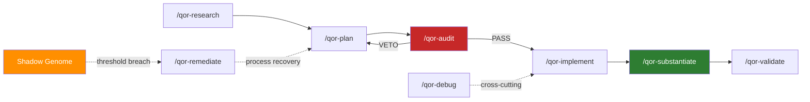

<p align="center">
  <strong>QorLogic</strong><br>
  Standards-Aligned Governance for AI Coding Agents
</p>

<p align="center">
  <a href="https://pypi.org/project/qor-logic/"></a>
  
  
  
  
  
  
  
  
  
  
</p>

<p align="center">
  <a href="#whats-new-in-v0220">What's New</a> |
  <a href="#quick-start">Quick Start</a> |
  <a href="#lifecycle">Lifecycle</a> |
  <a href="#policy-engine">Policy Engine</a> |
  <a href="#skill-catalog">Skills</a> |
  <a href="#governance-model">Governance</a> |
  <a href="#key-documentation">Docs</a> |
  <a href="CONTRIBUTING.md">Contributing</a>
</p>

---

## What QorLogic Does

QorLogic is a governance framework that ships curated skills, doctrines, and runtime enforcement to AI coding agents. It covers the full software development lifecycle with hash-chained evidence, machine-enforceable policies, and a process-failure feedback loop.

Supported hosts: **Claude Code**, **Kilo Code**, **Codex** (provisional), **Gemini CLI**.

Built around **S.H.I.E.L.D.**: Single-purpose, Hash-chained, Idempotent, Explicit, Layered, Delegating.

## What's new in v0.22.0

- **Documentation-integrity machinery is now enforced at seal time.** A four-tier doctrine (`minimal` / `standard` / `system` / `legacy`) governs which docs must exist; `/qor-substantiate` hard-blocks on tier violations; WARNS when phase changes ship without updating the 4 system-tier docs. Qor-logic itself now runs at `doc_tier: system`.
- **PR description citations are CI-enforced.** Every PR must cite plan file + ledger entry + Merkle seal per `doctrine-governance-enforcement.md` §6. Enforced by `.github/workflows/pr-lint.yml`.
- **Dist variants rebuild automatically on seal** (Step 8.5). Install-sync is CI-tested via SHA256 match of source SKILL.md files vs per-host variants.
- **Session rotation on seal.** `session.rotate()` issues a fresh session_id after each `/qor-substantiate`; prior session directories preserved for archaeology.
- **Check Surface D + E scope-fence tuning.** Lenient-by-default; ad-hoc `python -m qor.scripts.doc_integrity_drift_report` CLI surfaces term-drift + cross-doc conflicts for operator triage.

See [CHANGELOG.md](CHANGELOG.md) for the full release history (v0.19.0 through v0.22.0 introduced the documentation-integrity system in four phases).

## Quick Start

### Install from PyPI

```bash
pip install qor-logic
```

### Deploy skills to your AI coding host

By default QorLogic installs into the **current workspace** (`./.<host>/`). Use `--scope global` for user-wide install under `~/.<host>/`.

```bash
# Initialize with host + scope (scope defaults to repo)
qorlogic init --host claude --profile sdlc                 # repo scope
qorlogic init --host gemini --profile sdlc --scope global  # global scope

# Install governance skills and agent personas
qorlogic install --host claude                # -> ./.claude/
qorlogic install --host gemini                # -> ./.gemini/commands/
qorlogic install --host codex --scope global  # -> ~/.codex/

# Verify the installation
qorlogic list --available
```

Supported host layouts:

| Host | Default folder (repo scope) | File format |
|------|-----------------------------|-------------|
| `claude` | `./.claude/skills/`, `./.claude/agents/` | Markdown |
| `kilo-code` | `./.kilo-code/skills/`, `./.kilo-code/agents/` | Markdown |
| `codex` | `./.codex/skills/`, `./.codex/agents/` | Markdown |
| `gemini` | `./.gemini/commands/` | TOML |

Set `QORLOGIC_PROJECT_DIR` to override the repo root.

### Or install to a custom target

```bash
# Non-standard host, filesystem governance, or data pipeline projects
qorlogic install --host claude --target /path/to/custom/dir/
```

### Use in your AI coding session

```
/qor-plan          # author a phased implementation plan
/qor-audit         # adversarial PASS/VETO tribunal
/qor-implement     # build under Section 4 Razor constraints
/qor-substantiate  # seal with Merkle hash evidence
```

Contributors: see [CONTRIBUTING.md](CONTRIBUTING.md) for the canonical chain and the "what not to do" list.

## Lifecycle

QorLogic enforces a phased governance lifecycle. Each phase gates the next. Every decision is SHA256-chained in the Meta Ledger.



Each transition produces a ledger entry. VETO loops back to planning. Process failures accumulate in the Shadow Genome and auto-trigger remediation at configurable thresholds.

## Policy Engine

QorLogic includes a Cedar-inspired policy evaluator written in pure Python. Policies are data files, not hardcoded logic.

```cedar
// qor/policies/gate_enforcement.cedar
permit (
  principal,
  action == Action::"implement",
  resource == Gate::"plan"
) when { resource.verdict == "PASS" };

forbid (
  principal,
  action == Action::"implement",
  resource == Gate::"plan"
) when { resource.verdict == "VETO" };
```

Evaluate policies from the CLI:

```bash
qorlogic policy check request.json
```

The evaluator supports `permit`/`forbid` effects, `==` and `in` constraints, `when` conditions, and default-deny semantics (forbid overrides permit). Designed for compatibility with the [Cedar](https://www.cedarpolicy.com/) language; swap in a native Cedar SDK when Python bindings ship.

## Standards Alignment

### NIST SP 800-218A (SSDF for AI)

QorLogic maps its lifecycle to the Secure Software Development Framework practices defined in [NIST SP 800-218A](https://doi.org/10.6028/NIST.SP.800-218A):

| SSDF Practice Group | QorLogic Implementation |
|---|---|
| **PO** Prepare the Organization | `/qor-bootstrap`, 14 doctrine files, `CLAUDE.md` drop-in, [CONTRIBUTING.md](CONTRIBUTING.md) |
| **PS** Protect the Software | `/qor-audit` tribunal, reliability scripts, Shadow Genome |
| **PW** Produce Well-Secured Software | `/qor-plan` > `/qor-audit` > `/qor-implement` > `/qor-substantiate` |
| **RV** Respond to Vulnerabilities | `/qor-remediate`, `/qor-debug`, threshold-triggered issue creation |

Full mapping: [`qor/references/doctrine-nist-ssdf-alignment.md`](qor/references/doctrine-nist-ssdf-alignment.md)

### OWASP Top 10

The codebase has been [audited against OWASP Top 10 (2021)](docs/security-audit-2026-04-16.md). Findings: 0 HIGH, 3 MEDIUM (integrity-hardening), 6 LOW (hygiene). No exploitable vulnerabilities. All subprocess calls use list-form argv. No shell injection surface. No unsafe deserialization.

## Skill Catalog

### SDLC Chain (9 skills)

| Skill | Phase | Purpose |
|---|---|---|
| `/qor-research` | research | Investigate before planning |
| `/qor-plan` | plan | Author phased plans with tests |
| `/qor-audit` | gate | Adversarial PASS/VETO tribunal |
| `/qor-implement` | implement | Build under KISS constraints |
| `/qor-refactor` | implement | Section 4 Razor cleanup |
| `/qor-debug` | cross-cutting | Root-cause diagnosis |
| `/qor-substantiate` | substantiate | Seal with Merkle evidence |
| `/qor-validate` | validate | Chain and criteria verification |
| `/qor-remediate` | process recovery | Process-level fix from Shadow Genome |

### Memory and Meta (9 skills)

| Skill | Purpose |
|---|---|
| `/qor-status` | Diagnose lifecycle state and next action |
| `/qor-tone` | Set session communication tier (technical / standard / plain) |
| `/qor-document` | Update governance documentation |
| `/qor-organize` | Project-level structure reorganization |
| `/qor-bootstrap` | Seed a new workspace with governance DNA |
| `/qor-help` | In-skill command catalog |
| `/qor-repo-audit` | Repository-level compliance audit |
| `/qor-repo-release` | Release ceremony orchestration |
| `/qor-repo-scaffold` | New-repo template generation |

### Workflow Bundles (5 bundles)

| Bundle | Phases | Use When |
|---|---|---|
| `/qor-deep-audit` | recon (3) + remediate (3) | Pre-release readiness, tech-debt sweep |
| `/qor-deep-audit-recon` | research + synthesize + verify | Investigation only; ends at RESEARCH_BRIEF |
| `/qor-deep-audit-remediate` | plan + implement + validate | Action half; consumes RESEARCH_BRIEF |
| `/qor-onboard-codebase` | research > organize > audit > plan | Absorbing an external codebase |
| `/qor-process-review-cycle` | shadow-sweep > remediate > audit | Periodic process health check |

### Governance (1 skill)

| Skill | Purpose |
|---|---|
| `/qor-shadow-process` | Append structured process-failure events |

## Governance Model

1. **Every decision is logged.** Plans, audits, and substantiations land in `docs/META_LEDGER.md` as SHA256-chained entries. Verify the full chain: `qorlogic verify-ledger`.

2. **Gates are advisory with teeth.** Skills check for prior-phase artifacts. Override is permitted but logged as a severity-1 `gate_override` event in the Shadow Genome.

3. **Process failures are append-only.** `docs/PROCESS_SHADOW_GENOME.md` stores JSONL events that flow through stale-expiry rules and aged-high-severity self-escalation. Threshold breach (severity sum >= 10) triggers `/qor-remediate`.

4. **Policies are data.** Cedar-syntax `.cedar` files under `qor/policies/` define permit/forbid rules evaluated at gate check points. The policy engine logs every decision for audit.

5. **Skills delegate explicitly.** When `/qor-audit` finds a Razor violation, it names `/qor-refactor`. No skill reinvents another skill's process. ([delegation-table](qor/gates/delegation-table.md))

6. **Bundles checkpoint and budget.** Multi-phase workflows declare budgets and surface progress between phases. Context windows stay manageable. ([workflow-bundles](qor/gates/workflow-bundles.md))

## Architecture

```
qor-logic/
  qor/
    skills/           28 skills + 5 bundles (governance, sdlc, memory, meta)
    agents/           13 agent personas
    policy/           Cedar-inspired permit/forbid evaluator (pure Python)
    policies/         .cedar policy files (gate enforcement, skill admission, OWASP)
    scripts/          Runtime: ledger, gates, shadow, platform, compiler, remediate, doc-integrity (core + strict), drift-report, pr-citation-lint, changelog-stamp
    reliability/      Intent Lock, Skill Admission, Gate-to-Skill Matrix
    references/       14 doctrines + 7 patterns + 7 ql-templates + glossary + skill-recovery-pattern
    gates/            Phase chain, delegation table, workflow bundles, 9 JSON schemas
    resources.py      importlib.resources wrapper for packaged assets
    workdir.py        $QOR_ROOT / CWD anchor for consumer-state paths
    hosts.py          Host-to-install-path resolver (claude, kilo, codex, gemini)
    cli.py            qorlogic CLI entry point
    dist/variants/    Pre-compiled per-host outputs (claude, kilo-code, codex, gemini)
  docs/
    architecture.md   System-tier doc: layer stack + responsibilities
    lifecycle.md      System-tier doc: phase sequence + substantiate steps
    operations.md     System-tier doc: operator runbook + CLI + runbook
    policies.md       System-tier doc: policy files + standards alignment
    META_LEDGER.md    SHA256-chained decision log (104 entries sealed)
    SHADOW_GENOME.md  Narrative failure-pattern catalog (21 entries)
    SYSTEM_STATE.md   Current repo state snapshot
    BACKLOG.md        Work queue
  tests/              602 tests (unit, integration, e2e, doctrine, bundle contract, install-sync, workflow-budget)
  .github/workflows/  ci.yml + release.yml + pr-lint.yml (PR citation enforcement)
```

## CLI Reference

```
qorlogic install --host <claude|kilo-code|codex|gemini> [--scope <repo|global>] [--target <path>] [--dry-run]
qorlogic uninstall --host <host> [--scope <repo|global>]
qorlogic init --host <host> [--scope <repo|global>] --profile <sdlc|filesystem|data|research>
qorlogic list [--available] [--installed] [--host <host>] [--scope <repo|global>]
qorlogic info <skill-name>
qorlogic compile [--dry-run]
qorlogic verify-ledger [<path>]
qorlogic policy check <request.json>
qorlogic --version
```

## Development

```bash
pip install -e ".[dev]"
python -m pytest tests/                                    # 602 tests
python -m pytest tests/ -m integration                     # +4 install-smoke tests
qorlogic verify-ledger                                     # Merkle chain integrity
BUILD_REGEN=1 python qor/scripts/dist_compile.py           # regenerate variants
python qor/scripts/check_variant_drift.py                  # SSoT vs dist consistency
```

## Key Documentation

### System-tier docs (the four pillars)

| Document | Purpose |
|---|---|
| [`docs/architecture.md`](docs/architecture.md) | Layer stack: entry points -> references -> gates -> skills -> scripts -> policies -> artifacts |
| [`docs/lifecycle.md`](docs/lifecycle.md) | Phase sequence + per-phase contracts + substantiate step expansion (Steps 0-Z) + session/branch/version models |
| [`docs/operations.md`](docs/operations.md) | Operator runbook: CLI, seal ceremony, push/merge, failure recovery, CI, dist variants, troubleshooting |
| [`docs/policies.md`](docs/policies.md) | Policy files, OWASP/NIST alignment, change_class contract, shadow-genome rubric, escape paths |

### Entry points + governance

| Document | Purpose |
|---|---|
| [`CLAUDE.md`](CLAUDE.md) | Drop-in token-efficiency + test-discipline + governance-flow defaults |
| [`CONTRIBUTING.md`](CONTRIBUTING.md) | Reading order + quickstart + what-not-to-do for contributors |
| [`CHANGELOG.md`](CHANGELOG.md) | User-facing release narrative (Keep-a-Changelog 1.1.0) |
| [`docs/META_LEDGER.md`](docs/META_LEDGER.md) | SHA256-chained governance log (104 entries sealed) |
| [`docs/SHADOW_GENOME.md`](docs/SHADOW_GENOME.md) | Narrative failure-pattern catalog (21 entries) |
| [`docs/SYSTEM_STATE.md`](docs/SYSTEM_STATE.md) | Current repo state snapshot (updated per seal) |
| [`docs/phase31-drift-triage-report.md`](docs/phase31-drift-triage-report.md) | Live drift triage artifact (Check Surface D/E) |

### Gates + routing

| Document | Purpose |
|---|---|
| [`qor/gates/chain.md`](qor/gates/chain.md) | Canonical phase sequence (research -> plan -> audit -> implement -> substantiate -> validate -> remediate) |
| [`qor/gates/delegation-table.md`](qor/gates/delegation-table.md) | Skill-to-skill handoff matrix |
| [`qor/gates/workflow-bundles.md`](qor/gates/workflow-bundles.md) | Bundle checkpoint and budget protocol |

### Audits + standards

| Document | Purpose |
|---|---|
| [`docs/RESEARCH_BRIEF.md`](docs/RESEARCH_BRIEF.md) | Phase 28 recon: documentation-integrity gap audit (18 gaps identified, all closed by Phase 31) |
| [`docs/security-audit-2026-04-16.md`](docs/security-audit-2026-04-16.md) | OWASP Top 10 + stability audit |
| [`qor/references/doctrine-nist-ssdf-alignment.md`](qor/references/doctrine-nist-ssdf-alignment.md) | NIST SP 800-218A lifecycle mapping |
| [`qor/references/doctrine-shadow-genome-countermeasures.md`](qor/references/doctrine-shadow-genome-countermeasures.md) | Codified failure patterns (SG-016 through SG-Phase31-B) |

### Doctrines (complete inventory)

Each doctrine under `qor/references/` carries a single rule or convention cited by one or more skills.

| Doctrine | Purpose |
|---|---|
| [audit-report-language](qor/references/doctrine-audit-report-language.md) | VETO ground-class to skill directive mapping |
| [changelog](qor/references/doctrine-changelog.md) | Keep-a-Changelog discipline + seal-time stamp |
| [ci-budget](qor/references/doctrine-ci-budget.md) | CI compute and latency budget |
| [code-quality](qor/references/doctrine-code-quality.md) | Section 4 Simplicity Razor + anti-slop rules |
| [communication-tiers](qor/references/doctrine-communication-tiers.md) | Technical / standard / plain output tiers |
| [documentation-integrity](qor/references/doctrine-documentation-integrity.md) | Tiered doc topology + glossary + check surface + documentation currency |
| [governance-enforcement](qor/references/doctrine-governance-enforcement.md) | Branch / version / tag / push / session-rotation / PR-citation protocol |
| [nist-ssdf-alignment](qor/references/doctrine-nist-ssdf-alignment.md) | NIST SP 800-218A practice-tag mapping |
| [owasp-governance](qor/references/doctrine-owasp-governance.md) | OWASP Top 10 governance integration |
| [prompt-resilience](qor/references/doctrine-prompt-resilience.md) | Autonomy classification + pause-smell detection |
| [shadow-attribution](qor/references/doctrine-shadow-attribution.md) | Shadow skill attribution rules |
| [shadow-genome-countermeasures](qor/references/doctrine-shadow-genome-countermeasures.md) | SG-016 through SG-038 failure-pattern countermeasures |
| [test-discipline](qor/references/doctrine-test-discipline.md) | TDD, definition of done, reliability rules |
| [token-efficiency](qor/references/doctrine-token-efficiency.md) | Terse-by-default output + read/write discipline |

Patterns and templates (non-binding references):

- [patterns-agent-design](qor/references/patterns-agent-design.md), [patterns-architecture](qor/references/patterns-architecture.md), [patterns-devops](qor/references/patterns-devops.md), [patterns-project-planning](qor/references/patterns-project-planning.md), [patterns-skill-lifecycle](qor/references/patterns-skill-lifecycle.md), [patterns-ui-diagnosis](qor/references/patterns-ui-diagnosis.md), [patterns-voice-integration](qor/references/patterns-voice-integration.md)
- [ql-audit-templates](qor/references/ql-audit-templates.md), [ql-bootstrap-templates](qor/references/ql-bootstrap-templates.md), [ql-implement-patterns](qor/references/ql-implement-patterns.md), [ql-organize-templates](qor/references/ql-organize-templates.md), [ql-refactor-examples](qor/references/ql-refactor-examples.md), [ql-substantiate-templates](qor/references/ql-substantiate-templates.md), [ql-validate-reports](qor/references/ql-validate-reports.md)
- [skill-recovery-pattern](qor/references/skill-recovery-pattern.md)
- [glossary](qor/references/glossary.md) -- canonical term registry introduced in Phase 28

## Shadow Genome

The Shadow Genome is QorLogic's institutional memory for failure patterns. Every governance failure (plan VETOes, import breakage, arithmetic drift, silent data loss) is recorded, classified, and codified as a countermeasure.

12 patterns codified so far:

| ID | Pattern | Countermeasure |
|---|---|---|
| SG-016 | Generic-convention paths without grounding | Grep/read before citing any path |
| SG-021 | Multi-layer edit compression | Enumerate every file that receives the edit |
| SG-032 | Batch-split-write coverage gap | Classify records at creation, not post-hoc |
| SG-033 | Positional-to-keyword signature breakage | Grep all callers before adding `*` |
| SG-036 | Doctrine adoption grace period | No grace period; inline grounding immediately |
| SG-038 | Prose-code mismatch in plans | Grep plan for every enumeration; update in lockstep |

Full inventory: [`qor/references/doctrine-shadow-genome-countermeasures.md`](qor/references/doctrine-shadow-genome-countermeasures.md)

## License

Business Source License 1.1 (BSL-1.1). Free for non-production use. Production deployment requires a commercial license from [MythologIQ Labs, LLC](https://github.com/MythologIQ-Labs-LLC). See [LICENSE](LICENSE) for details.

## Contributing

Skills live under `qor/skills/<category>/<skill-name>/SKILL.md` (the single source of truth). The `qor/dist/variants/` outputs are generated. Never edit them directly.

To author a new skill:

1. Pick a category: `governance`, `sdlc`, `memory`, or `meta`.
2. Create `qor/skills/<category>/<name>/SKILL.md` with required frontmatter (`name`, `description`, `phase`, `gate_reads`, `gate_writes`).
3. Add a row to [`qor/gates/delegation-table.md`](qor/gates/delegation-table.md).
4. Register in [`/qor-help`](qor/skills/meta/qor-help/SKILL.md).
5. Regenerate: `BUILD_REGEN=1 python qor/scripts/dist_compile.py`
6. Test: `python -m pytest tests/`

For workflow bundles, follow the metadata schema in [`qor/gates/workflow-bundles.md`](qor/gates/workflow-bundles.md). Bundle contract tests in `tests/test_bundles.py` cover new bundles automatically.
