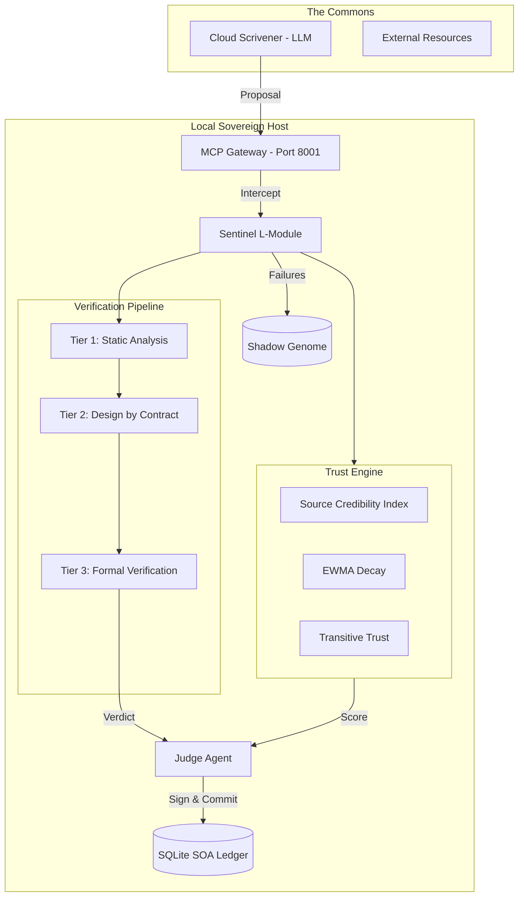

# Q-DNA Architecture Specification (Sovereign Fortress)

**Version:** 2.0
**Last Updated:** December 17, 2025
**Scope:** Hardware, Software, Network, and Trust topology for Q-DNA governance
**Research Foundation:** See [Research Library](./research/INDEX.md)

---

## 1. Architectural Principles

### 1.1 Sovereign Fortress

All verification, identity, and audit functions execute locally. No critical data traverses external networks.

### 1.2 Defense in Depth

Multiple verification tiers, each catching errors that slip through previous layers.

### 1.3 Probabilistic Trust

Trust is earned, decays over time, and propagates with damping. No static assumptions.

### 1.4 Fail Forward

Every failure is archived and converted into training constraints for future improvement.

---

## 2. Top-Level Topology



---

## 3. Component Specifications

### 3.1 The MCP Gateway (SOA-Gate)

| Property      | Specification                   |
| :------------ | :------------------------------ |
| **Protocol**  | JSON-RPC 2.0 (MCP-compatible)   |
| **Transport** | stdio / HTTP / WebSocket        |
| **Port**      | 8001 (dedicated)                |
| **Security**  | Deny-by-default; DID whitelist  |
| **Schema**    | Pydantic models for type safety |

**Backpressure Mechanism:**

- Queue bound: 50 requests
- Warning at 80% capacity
- Load shedding at 100%
- LIFO for interactive, FIFO for batch

### 3.2 The Sentinel (Verification Engine)

#### 3.2.1 Multi-Tier Verification Pipeline

| Tier  | Method              | Tools                       | Latency | Scope    |
| :---- | :------------------ | :-------------------------- | :------ | :------- |
| **1** | Static Analysis     | Pylint, Flake8, MyPy        | <0.5s   | All code |
| **2** | Design by Contract  | `deal` library              | <1.0s   | All code |
| **3** | Formal Verification | PyVeritas → CBMC, CrossHair | <5.0s   | L3 only  |

#### 3.2.2 Model Options

| Model               | Size   | RAM    | Use Case |
| :------------------ | :----- | :----- | :------- |
| Phi-3 Mini (q4_k_m) | ~1.7GB | <2GB   | Primary  |
| Gemma 2B (q4_k_m)   | ~1.2GB | <1.5GB | Edge     |
| HRM Latent (27M)    | ~50MB  | <100MB | Future   |

#### 3.2.3 Runtime Constraints

| Resource   | Limit                 | Trigger      |
| :--------- | :-------------------- | :----------- |
| RAM        | 2GB max               | Hard cap     |
| CPU        | 70% sustained (5 min) | LEAN mode    |
| Nice Level | 10                    | Low priority |

### 3.3 The Judge (Policy Enforcement)

#### 3.3.1 Identity & Signing

| Property    | Specification              |
| :---------- | :------------------------- |
| Algorithm   | Ed25519                    |
| Key Storage | Encrypted keyfile (Fernet) |
| Rotation    | 30 days (NIST SP 800-57)   |
| Identity    | DID per agent              |

#### 3.3.2 Penalty Framework (HILS)

| Level        | Trigger                | Penalty | Cooling-Off |
| :----------- | :--------------------- | :------ | :---------- |
| Micro        | Schema, API, citation  | 0.5-2%  | None        |
| Honest Error | Calibration >0.2       | 5%      | 24 hours    |
| Manipulation | Tampering, fabrication | 25%     | 48 hours    |

### 3.4 The Trust Engine

#### 3.4.1 Source Credibility Index (SCI)

| Threshold             | Score | Action         |
| :-------------------- | :---- | :------------- |
| Gold Standard         | ≥90   | Auto-accept    |
| Verification Required | 60-89 | Sentinel audit |
| Human-in-the-Loop     | 40-59 | Escalate       |
| Hard Rejection        | <35   | Block          |

#### 3.4.2 Dynamic Decay (EWMA)

```
SCI_new = λ × SCI_old + (1-λ) × (Verification × ω)
```

| Parameter    | High-Risk | Low-Risk |
| :----------- | :-------- | :------- |
| λ (decay)    | 0.94      | 0.97     |
| ω (positive) | 1.0       | 1.0      |
| ω (negative) | 1.5       | 1.5      |

#### 3.4.3 Transitive Trust

```
Trust_{A→C} = Trust_{A→B} × Trust_{B→C} × δ
```

| Parameter   | Value | Rationale            |
| :---------- | :---- | :------------------- |
| δ (damping) | 0.5   | Trust halves per hop |
| Max hops    | 3     | Dunbar research      |

### 3.5 The Persistence Layer (SOA Ledger)

| Property   | Specification            |
| :--------- | :----------------------- |
| Technology | SQLite 3                 |
| Location   | `local_fortress/ledger/` |
| Integrity  | Merkle chain + Ed25519   |

**Hash Formula:**

```
hash(n) = SHA256(timestamp + payload + hash(n-1))
signature = Ed25519_Sign(private_key, hash(n))
```

**Tables:** 11 (see DEVELOPMENT_PLAN.md)

### 3.6 The Shadow Genome

| Property | Specification                      |
| :------- | :--------------------------------- |
| Purpose  | Failure archival for learning      |
| Schema   | `{input, code, error, constraint}` |
| Usage    | Negative constraints for Sentinel  |

---

## 4. Data Flow

### 4.1 Standard Verification Flow

```
1. Draft      → Scrivener (Cloud) proposes change
2. Ingest     → MCP Gateway receives proposal
3. Tier 1     → Static analysis (Pylint, Flake8, MyPy)
4. Tier 2     → Contract verification (deal)
5. Tier 3     → Formal verification (L3 only)
6. Trust      → Calculate agent trust score (λ decay)
7. Verdict    → Sentinel returns PASS/FAIL + rationale
8. Record     → Judge signs and appends to Ledger
9. Action     → IDE accepts (PASS) or rejects (FAIL)
```

### 4.2 L3 Escalation Flow

```
1. L3 Trigger → Code pattern matches L3 rules
2. Pause      → Workflow suspended
3. Notify     → Overseer receives approval request
4. Human      → Overseer reviews and signs
5. Resume     → Workflow continues with approval token
6. Record     → Human approval logged to Ledger
```

### 4.3 Failure Archival Flow

```
1. Fail       → Verification returns FAIL
2. Context    → Capture {input, code, error}
3. Extract    → Derive "Negative Constraint"
4. Archive    → Store in Shadow Genome
5. Learn      → Future Sentinel training uses constraint
```

---

## 5. Isolation & Security

### 5.1 The "Clean Room" Protocol

| Mechanism         | Implementation                 |
| :---------------- | :----------------------------- |
| Port Separation   | Q-DNA: 8001, Hearthlink: 8002+ |
| File Lock         | SQLite exclusive lock          |
| Process Isolation | Separate process space         |
| No Shared Memory  | No RAG vector overlap          |

### 5.2 Access Control

| Entity           | Access Level                  |
| :--------------- | :---------------------------- |
| Overseer (Human) | Full (L3 approval)            |
| Judge            | Write (Ledger)                |
| Sentinel         | Read (code) + Write (verdict) |
| Scrivener        | Submit only                   |
| External         | Blocked                       |

---

## 6. Edge Deployment (RPi 4)

### 6.1 Constraints

| Resource | Limit                       |
| :------- | :-------------------------- |
| RAM      | 4GB total                   |
| Model    | <2GB (leaves 1.5GB runtime) |
| CPU      | ARM (no GPU)                |

### 6.2 Recommended Stack

| Component    | Selection            |
| :----------- | :------------------- |
| OS           | Raspberry Pi OS Lite |
| Inference    | Ollama               |
| Model        | Gemma 2B (q4_k_m)    |
| Framework    | uAgents (Fetch.ai)   |
| Vector Store | Chroma (local)       |

---

## 7. Operational Modes

| Mode       | Trigger          | Behavior          |
| :--------- | :--------------- | :---------------- |
| **NORMAL** | Default          | Full verification |
| **LEAN**   | CPU >70% (5 min) | L1 sampling (10%) |
| **SURGE**  | Queue >50        | L1 deferred       |
| **SAFE**   | Security event   | Human-only L3     |

---

## 8. Compliance Architecture

### 8.1 Audit Log Schema

```json
{
  "event_id": "UUID-v4",
  "timestamp": "ISO-8601-UTC",
  "actor": {
    "agent_id": "DID",
    "model_version": "string",
    "trust_score": 0.0-1.0
  },
  "action": {
    "type": "EXECUTE_TOOL",
    "tool_name": "string",
    "parameters": {}
  },
  "verification": {
    "required": true,
    "method": "PyVeritas",
    "result": "PASS/FAIL",
    "verifier_id": "DID"
  },
  "governance": {
    "gdpr_art22_trigger": false,
    "human_approver": "DID or null"
  }
}
```

### 8.2 Regulatory Mapping

| Regulation   | Architecture Component     |
| :----------- | :------------------------- |
| GDPR Art. 22 | L3 HITL + governance field |
| NIST AI RMF  | SOA Ledger + modes         |
| ISO 42001    | Audit log schema           |

---

## 9. References

- **[MAC-002]** Model Context Protocol
- **[TRUST-001]** EigenTrust Algorithm
- **[TRUST-004]** RiskMetrics Decay
- **[LLM-001]** Verification Pipeline Research
- **[SRE-001]** Google SRE Backpressure

See [Research Library](./research/INDEX.md) for full citations.

---

## Changelog

| Version | Date           | Changes                                                         |
| :------ | :------------- | :-------------------------------------------------------------- |
| 1.0     | 2025-12        | Initial topology                                                |
| **2.0** | **2025-12-17** | **Full research integration, trust engine, verification tiers** |
