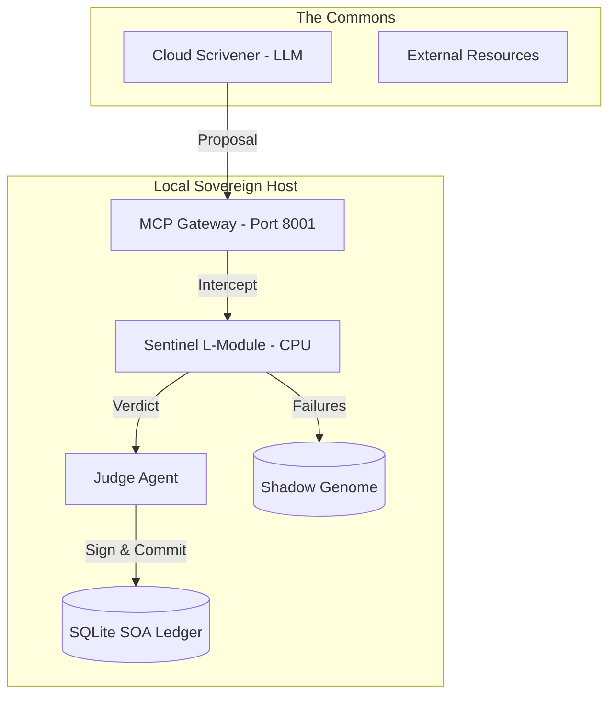

# Q-DNA: End-to-End (E2E) Architecture Review

**Date:** December 17, 2025
**Status:** Review Complete (v2.3)
**Last Updated:** Post-Research Integration

---

## 1. Executive Summary

This document reviews the Q-DNA architecture from end-to-end, tracking the resolution of previously identified gaps and documenting the current system state.

### Gap Resolution Status

| Gap               | Original Issue                | Resolution                                     | Status |
| :---------------- | :---------------------------- | :--------------------------------------------- | :----: |
| Air Gap Interface | No active MCP Server          | `server.py` implemented with 36 tools          |   ✅   |
| Context Blindness | Sentinel lacked project graph | AST parsing + import analysis                  |   ✅   |
| Missing HITL      | No L3 pause mechanism         | `request_l3_approval` + approval queue         |   ✅   |
| Fragile Identity  | Loose JSON credentials        | Ed25519 + encrypted keyfiles + rotation        |   ✅   |
| Shadow Genome     | Not implemented               | `shadow_genome` table + `archive_failure` tool |   ✅   |

---

## 2. Current Architecture

### 2.1 Component Topology



### 2.2 Communication Protocol

Per Multi-Agent Coordination research [MAC-002]:

| Layer     | Standard         | Implementation                    |
| :-------- | :--------------- | :-------------------------------- |
| Transport | JSON-RPC 2.0     | MCP (Model Context Protocol)      |
| Semantics | Pydantic schemas | Type-safe request/response        |
| Discovery | Dynamic          | mDNS for local, ledger for global |

### 2.3 Verification Pipeline

Per LLM Reliability research [LLM-001]:

```
┌────────────────────────────────────────────────────────┐
│                  VERIFICATION TIERS                    │
├────────────────────────────────────────────────────────┤
│  TIER 1: Static Analysis                               │
│  ├── Pylint (style, conventions)                       │
│  ├── Flake8 (syntax, imports)                          │
│  └── MyPy (type checking)                              │
├────────────────────────────────────────────────────────┤
│  TIER 2: Design by Contract                            │
│  └── deal library (pre/post conditions)                │
├────────────────────────────────────────────────────────┤
│  TIER 3: Formal Verification (L3 only)                 │
│  ├── PyVeritas (Python → C transpilation)              │
│  ├── CBMC (Bounded Model Checking)                     │
│  └── CrossHair (Symbolic execution)                    │
└────────────────────────────────────────────────────────┘
```

---

## 3. Data Flow

### 3.1 Standard Verification Flow

```mermaid
sequenceDiagram
    participant User as Overseer (User)
    participant IDE as Antigravity (Scrivener)
    participant Bridge as MCP Gateway
    participant Engine as Sentinel
    participant DB as SOA Ledger

    User->>IDE: "Refactor auth_module.py"
    IDE->>IDE: Generates Code (Draft)

    rect rgb(20, 20, 20)
        Note right of IDE: The "Sovereign Boundary"
        IDE->>Bridge: audit_code(diff)
        Bridge->>Engine: Contextual Analysis
        Engine->>Engine: Tier 1 + Tier 2 checks

        alt Verdict == FAIL
            Engine->>DB: archive_failure (Shadow Genome)
            Bridge-->>IDE: Return FAIL (Block)
        else Verdict == PASS
            Engine->>DB: log_event (hash chain)
            Bridge-->>IDE: Return signed PASS token
        else Verdict == L3_TRIGGER
            Bridge-->>User: request_l3_approval
            User->>Bridge: approve_l3()
            Engine->>DB: Log approval + verdict
        end
    end

    IDE->>IDE: Commit with token
```



### 3.2 Trust-Weighted Flow

Per Trust Dynamics research [TRUST-001]:

```
1. Agent submits claim
2. Check agent trust score (λ-decayed)
   - CBT (0.0-0.5): Full verification
   - KBT (0.5-0.8): Sampling verification
   - IBT (>0.8): Expedited verification
3. Apply transitive trust (δ=0.5, max 3 hops)
4. Execute appropriate verification tier
5. Update trust score based on outcome
```

---

## 4. MCP Server Implementation

### 4.1 Tool Categories (36 Tools)

| Category         | Count | Purpose                  |
| :--------------- | :---: | :----------------------- |
| Sentinel         |   2   | Code/claim auditing      |
| Judge            |   2   | Event logging, penalties |
| Overseer         |   3   | L3 approval workflow     |
| Shadow Genome    |   1   | Failure archival         |
| Volatility       |   3   | TTL tracking             |
| SLA              |   1   | SLA status               |
| Identity         |   1   | Signature verification   |
| System           |   3   | Mode, status, health     |
| Credibility      |   4   | SCI management           |
| Quarantine       |   4   | Time-based quarantine    |
| Fallback         |   1   | Sentinel unavailable     |
| Deferral         |   4   | Disclosure windows       |
| Mode Enforcement |   2   | Operational modes        |
| Calibration      |   3   | Brier score tracking     |
| Reputation       |   2   | Auto-recovery            |

### 4.2 Database Schema (11 Tables)

| Table                 | Purpose          | Integrity        |
| :-------------------- | :--------------- | :--------------- |
| `soa_ledger`          | Event log        | Merkle chain     |
| `agent_registry`      | Agent DIDs       | Ed25519 signed   |
| `reputation_log`      | Penalty/reward   | Linked to events |
| `shadow_genome`       | Failure archive  | Training data    |
| `l3_approval_queue`   | HITL workflow    | Timeout enforced |
| `system_state`        | Operational mode | Single row       |
| `claim_volatility`    | TTL tracking     | Auto-expiry      |
| `source_credibility`  | SCI scores       | Tier-based       |
| `agent_quarantine`    | Quarantine       | 48h default      |
| `disclosure_deferral` | Deferral windows | Time-boxed       |
| `calibration_log`     | Brier scores     | Rolling window   |

---

## 5. Resource Governance

Per SRE research [SRE-001]:

### 5.1 Backpressure Implementation

| Mechanism      | Threshold    | Action          |
| :------------- | :----------- | :-------------- |
| Queue bound    | 50 requests  | Reject new      |
| CPU saturation | >70% (5 min) | Enter LEAN mode |
| Load shedding  | 100% queue   | Drop oldest     |

### 5.2 Edge Deployment Constraints

| Component    | Specification       | Constraint       |
| :----------- | :------------------ | :--------------- |
| Hardware     | RPi 4 (4GB)         | Target platform  |
| Model        | Phi-3 Mini (q4_k_m) | <2GB RAM         |
| Framework    | uAgents             | Minimal overhead |
| Vector Store | Qdrant/Chroma       | Lightweight      |

---

## 6. Compliance Mapping

Per AI Governance research [COMP-001, COMP-002]:

| Regulation   | Requirement          | Implementation     |
| :----------- | :------------------- | :----------------- |
| GDPR Art. 22 | Right to explanation | CoT in audit log   |
| NIST AI RMF  | Risk management      | SOA Ledger + modes |
| ISO 42001    | AI management        | Full audit schema  |
| CERT/CC      | Disclosure           | 90-day policy      |

---

## 7. Outstanding Items (P3 Research)

| Item                     | Complexity | Dependency       |
| :----------------------- | :--------- | :--------------- |
| Semantic Drift Monitor   | High       | Embedding model  |
| Diversity Quorum         | High       | Multi-model L3   |
| Real CBMC Integration    | Medium     | External tool    |
| Adversarial Review       | Medium     | Devil's advocate |
| Echo/Paraphrase Detector | Medium     | N-gram analysis  |

These items require ML capabilities beyond the current bootstrapping phase.

---

## 8. References

- [MAC-002] Model Context Protocol Documentation
- [LLM-001] HaluEval Hallucination Benchmarks
- [TRUST-001] EigenTrust Algorithm
- [SRE-001] Google SRE Handbook
- [COMP-001] GDPR Article 22
- [COMP-002] NIST AI RMF

See [Research Library](./research/INDEX.md) for full citations.
