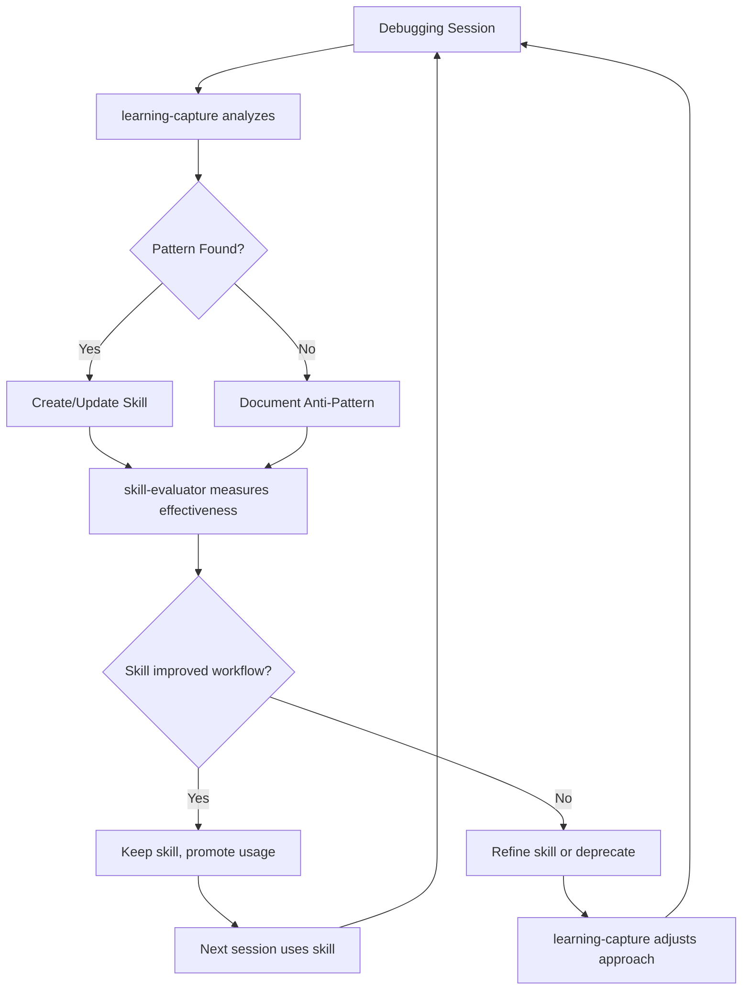

# Learning Capture Skill

**META-SKILL:** Automatically identifies patterns from debugging sessions and converts them into new skills or skill improvements.

## Purpose
The foundational skill that makes Claude Code evolve. After every significant debugging session (>20K tokens), this skill analyzes what was learned and either:
1. Creates a new skill to handle that problem class automatically
2. Improves an existing skill with new patterns/fixes
3. Documents anti-patterns to avoid in the future

## When to Trigger
- After resolving any issue that took >10K tokens
- When user says "we wasted a lot of time on X"
- After repeating similar debugging steps multiple times
- End of each coding session (proactive learning)

## What This Skill Does

### 1. Session Analysis
```markdown
## Extract Key Patterns

**Problem Indicators:**
- Repeated grep/search commands for same information
- Multiple file reads without finding the solution
- Trial-and-error approach (>3 failed attempts)
- Token usage spiking on a single issue

**Solution Indicators:**
- Final working fix/command sequence
- Root cause once identified
- Diagnostic command that revealed the issue
```

### 2. Pattern Classification

#### Type A: Diagnostic Pattern
*User had a problem, we diagnosed it through specific checks*
```
Example from 2025-10-24 session:
- Problem: "CSS not loading"
- Diagnostic: grep for @apply in built CSS file
- Root Cause: PostCSS not processing directives
- Skill Created: build-doctor (diagnostic checklist)
```

#### Type B: Procedural Pattern
*Task required specific sequence of steps*
```
Example from 2025-10-24 session:
- Problem: "Tauri window won't open"
- Steps: Kill processes → check ports → update config → relaunch
- Skill Created: tauri-launcher (orchestrated procedure)
```

#### Type C: Knowledge Pattern
*Missing understanding of how system works*
```
Example from 2025-10-24 session:
- Gap: @apply directives don't work in @import-ed CSS files
- Documentation: Tailwind PostCSS processing limitations
- Skill Updated: build-doctor (added @import check)
```

### 3. Skill Generation Template

```markdown
# [Skill Name]

## Purpose
[One sentence: What problem this prevents/solves]

## Usage
When user [describes trigger scenarios]

## What This Skill Does

### 1. [Detection/Diagnosis Step]
**Problem Learned:** [Specific issue from session]
\```bash
[Diagnostic commands]
\```

### 2. [Fix/Solution Step]
**Fix Applied:** [Solution that worked]
\```bash
[Fix commands]
\```

## Expected Output
[Show user what successful run looks like]

## Agent Assignment
- **Primary:** [which agent runs this]
- **MCP Access:** [required MCP servers]

## Token Savings
- **Before:** [estimated tokens without skill]
- **After:** [estimated tokens with skill]
- **Savings:** [X tokens (Y% reduction)]

## Learning from Session
[Date and key discoveries encoded]
```

### 4. Skill Improvement Detection

```bash
# Check if similar skill already exists
find .claude/skills -name "*.md" -exec grep -l "[pattern]" {} \;

# If exists: merge new learnings into existing skill
# If not: create new skill file
```

### 5. Anti-Pattern Documentation

```markdown
# .claude/skills/anti-patterns.md

## ❌ Avoid: Manual CSS Processing Debugging
**Why:** Wastes 80K+ tokens
**Instead:** Run build-doctor skill (2K tokens)
**Learned:** 2025-10-24 session

## ❌ Avoid: Trial-and-Error Port Configuration
**Why:** Each attempt costs 5K+ tokens
**Instead:** Run tauri-launcher skill (1K tokens)
**Learned:** 2025-10-24 session
```

## Expected Output

```markdown
## Learning Capture Report - Session 2025-10-24

### 📊 Session Metrics
- Total tokens: 80,542
- Issue: CSS not rendering, Tauri window not opening
- Root causes identified: 2 (PostCSS processing, port mismatch)
- Solution time: 3 hours

### 🧠 Patterns Identified

**Pattern 1: Build Configuration Diagnosis**
- Token cost: ~40K
- Repeated actions: File reading (8x), grepping (12x), manual CSS inspection
- Solution: Specific diagnostic checklist
- **Skill Created:** `build-doctor.md`
- **Estimated future savings:** 38K tokens/occurrence

**Pattern 2: Tauri Launch Management**
- Token cost: ~25K
- Repeated actions: Process killing, port checking, config updating
- Solution: Staged launch procedure
- **Skill Created:** `tauri-launcher.md`
- **Estimated future savings:** 23K tokens/occurrence

**Pattern 3: CSS Processing Knowledge Gap**
- Token cost: ~15K
- Gap: @import blocks @apply processing in Tailwind
- Solution: Inline CSS or use Tailwind CLI directly
- **Skill Updated:** `build-doctor.md` (added @import detection)

### 🎯 Skills Created
1. `.claude/skills/build-doctor.md` (NEW)
2. `.claude/skills/tauri-launcher.md` (NEW)
3. `.claude/skills/learning-capture.md` (META - this skill!)

### 📈 Projected Impact
If these patterns occur 5 more times this month:
- **Without skills:** 5 × 80K = 400K tokens
- **With skills:** 5 × 5K = 25K tokens
- **Net savings:** 375K tokens (94% reduction)

### 🔄 Continuous Improvement Recommendations

**Short-term (next session):**
- Test build-doctor on clean environment
- Validate tauri-launcher on Windows
- Create css-processor skill for granular CSS fixes

**Medium-term (this week):**
- Create skill-evaluator to measure skill effectiveness
- Add MCP server routing (assign skills to appropriate agents)
- Build skill-testing-framework for automated validation

**Long-term (this month):**
- Implement token-budget-advisor for context limit management
- Create skill-dependency-mapper to optimize skill interactions
- Build learning database to track pattern evolution over time
```

## Self-Improvement Loop



## Agent Assignment
- **Primary:** general-purpose (runs after every session)
- **Schedule:** End of session, or after >20K token issue resolved
- **MCP Access:**
  - filesystem (read conversation logs, create skill files)
  - None additional (skills are just markdown documentation)

## Meta-Learning Notes

**This skill itself will evolve through:**
1. Tracking which skills get created most often (reveals common problem areas)
2. Measuring token savings from generated skills
3. Identifying when same pattern gets re-discovered (skill wasn't clear enough)
4. Detecting skill gaps (problems that don't match any existing skill)

**Success Metrics:**
- Reduction in duplicate debugging sessions
- Token efficiency trend (tokens/problem solved over time)
- Skill usage rate (% of sessions where skills are proactively used)
- User satisfaction (less frustration, faster resolution)

## Encoded Learning from 2025-10-24 Session

**Key Discoveries:**
1. CRACO config can be correct but webpack still won't invoke PostCSS
2. @import statements prevent Tailwind from processing @apply directives
3. Tauri port mismatch is silent - window just doesn't appear
4. Background processes from previous sessions cause subtle conflicts
5. Tailwind CLI always works as fallback when webpack processing fails

**Skills Created from This Session:**
- build-doctor.md (diagnostic framework)
- tauri-launcher.md (launch orchestration)
- learning-capture.md (this meta-skill)

**Anti-Patterns Identified:**
- Don't manually debug CSS processing - use build-doctor
- Don't restart Tauri multiple times hoping - use tauri-launcher
- Don't spend 80K tokens - spend 5K tokens calling the right skill
