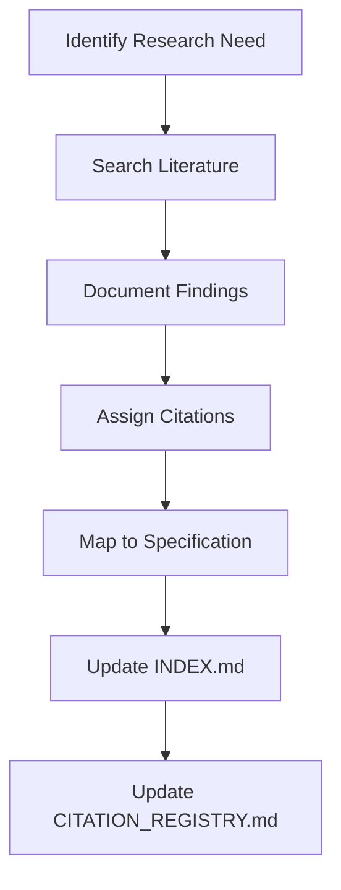
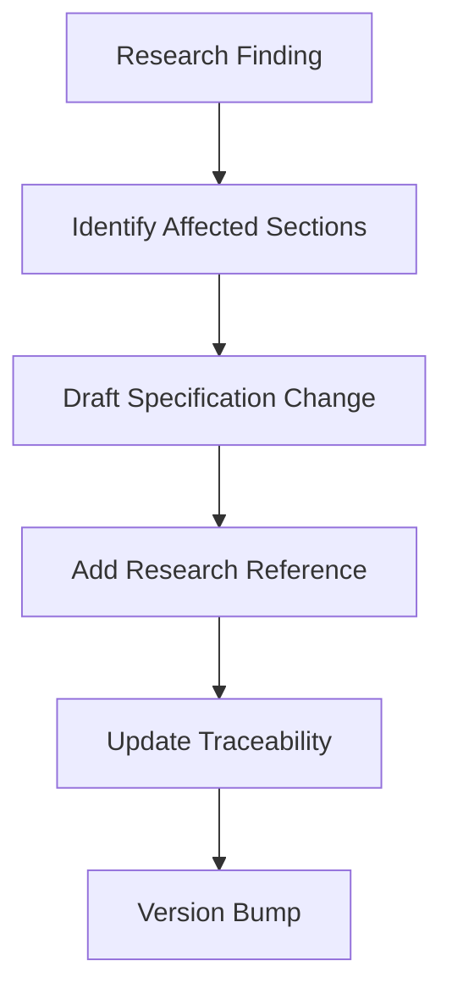

# Q-DNA Research Methodology and Citation Standards

**Version:** 1.0
**Created:** December 17, 2025
**Purpose:** Establish consistent standards for research documentation, citation, and traceability

---

## 1. Research Document Standards

### 1.1 Document Structure

Every research document follows this template:

```markdown
# [Topic Name]

**Category:** [Foundations | Technologies | Compliance | Benchmarks | Original | Synthesis]
**Version:** X.Y
**Last Updated:** YYYY-MM-DD
**Status:** [Draft | Review | Complete | Deprecated]
**Specification Links:** §X, §Y, §Z

---

## Executive Summary

[2-3 paragraph overview of key findings and relevance to Q-DNA]

---

## 1. Background and Context

[Why this research matters to Q-DNA]

## 2. Literature Review

[Organized by subtopic with citations]

## 3. Key Findings

[Bulleted or tabled findings with citations]

## 4. Application to Q-DNA

[How findings inform specification design]

## 5. Limitations and Gaps

[What the research doesn't address]

## 6. Recommendations

[Specific parameter values or design decisions]

---

## References

[Full citations in standard format]

---

## Changelog

| Version | Date       | Changes          |
| ------- | ---------- | ---------------- |
| 1.0     | YYYY-MM-DD | Initial creation |
```

### 1.2 Writing Standards

- **Objective Tone:** Present findings neutrally; separate facts from interpretation
- **Verifiable Claims:** Every quantitative claim requires a citation
- **Specification Mapping:** Always link findings to specification sections
- **Limitation Acknowledgment:** Explicitly state what research does NOT cover

---

## 2. Citation Format

### 2.1 Citation Identifiers

Each citation receives a unique identifier:

```
[CATEGORY-NNN]
```

| Category Code | Meaning                 |
| ------------- | ----------------------- |
| FORM          | Formal Methods          |
| TRUST         | Trust & Reputation      |
| BEHAV         | Behavioral Economics    |
| INFO          | Information Theory      |
| LLM           | Language Models & AI    |
| PRIV          | Privacy Engineering     |
| CRYPT         | Cryptography            |
| COMP          | Compliance & Legal      |
| SRE           | Site Reliability        |
| BENCH         | Benchmarks              |
| QDNA          | Original Q-DNA Research |

**Examples:**

- `[TRUST-001]` - First trust dynamics citation
- `[LLM-003]` - Third LLM reliability citation
- `[QDNA-001]` - First original Q-DNA finding

### 2.2 In-Text Citation

```markdown
Research indicates that HILS deterrence models outperform LIHS [BEHAV-001].
```

For multiple citations:

```markdown
Trust repair requires acknowledgment of responsibility [TRUST-001, TRUST-003].
```

### 2.3 Reference Entry Format

```markdown
[BEHAV-001] Nagin, D. (2013). "Deterrence in the Twenty-First Century."
Crime and Justice, 42(1), 199-263.
DOI: 10.1086/670398
URL: https://doi.org/10.1086/670398
Access Date: 2025-12-17

            Abstract: [1-2 sentence summary]

            Key Findings:
            - HILS (High Inspection/Low Severity) outperforms LIHS
            - Certainty of detection > severity of punishment

            Applied In: §9.1 (Micro-Penalty Layer)
            Confidence: High (peer-reviewed, widely cited)
```

### 2.4 Source Tiers

Citations are graded by reliability (aligned with Q-DNA SCI):

| Tier | Description                                       | Citation Confidence |
| ---- | ------------------------------------------------- | ------------------- |
| T1   | Peer-reviewed journals, RFCs, formal standards    | High                |
| T2   | Conference papers, technical reports (NIST, IEEE) | High                |
| T3   | Industry publications, reputable tech blogs       | Medium              |
| T4   | Community sources, grey literature                | Low                 |
| T5   | Unpublished, internal, or AI-generated            | Requires validation |

---

## 3. Traceability Standards

### 3.1 Specification Cross-Reference

Every research document includes a traceability section:

```markdown
## Specification Traceability

| Finding         | Spec Section | Parameter               | Value    |
| --------------- | ------------ | ----------------------- | -------- |
| HILS superior   | §9.1         | Micro-penalty detection | 100%     |
| 24h cooling-off | §9.3         | Cooling period          | 24 hours |
```

### 3.2 Reverse Traceability

The specification references research via:

```markdown
> _Per HILS research [BEHAV-001], frequent small penalties outperform infrequent severe ones. (See research/foundations/BEHAVIORAL_ECONOMICS.md)_
```

### 3.3 Gap Identification

When research doesn't fully address a design question:

```markdown
## Research Gap: [GAP-NNN]

**Question:** What is the optimal SCI threshold for security claims?
**Current State:** General trust thresholds exist; no security-specific calibration
**Impact:** §5.3.4 domain modifiers are based on heuristic, not data
**Priority:** Medium
**Proposed Resolution:** Pilot study with security reviewer feedback
```

---

## 4. Research Categories

### 4.1 Foundations

Theoretical research providing conceptual grounding.

**Characteristics:**

- Peer-reviewed academic sources
- Timeless principles (not tool-specific)
- High citation confidence

### 4.2 Technologies

Practical research on tools and implementations.

**Characteristics:**

- Mix of academic and industry sources
- May become outdated (include version/date)
- Benchmark data with confidence intervals

### 4.3 Compliance

Legal and regulatory requirements.

**Characteristics:**

- Primary sources (regulations, guidelines)
- Interpretation from legal/compliance experts
- Jurisdiction-specific notes

### 4.4 Benchmarks

Quantitative data informing thresholds.

**Characteristics:**

- Empirical measurements with methodology
- Confidence intervals and sample sizes
- Date of measurement (data freshness)

### 4.5 Original Findings

Q-DNA-specific research.

**Characteristics:**

- Methodology documented
- Raw data available or referenced
- Limitations explicitly stated
- Not yet externally validated (note this)

### 4.6 Synthesis

Documents integrating multiple research streams.

**Characteristics:**

- Cross-references other research docs
- Draws conclusions across domains
- Directly informs specification updates

---

## 5. Quality Assurance

### 5.1 Review Checklist

Before marking a research document "Complete":

- [ ] All claims have citations
- [ ] Citation identifiers are unique
- [ ] References include full details
- [ ] Specification sections are linked
- [ ] Limitations are acknowledged
- [ ] Source tiers are noted
- [ ] Changelog is updated

### 5.2 Periodic Review

Research documents should be reviewed:

| Category     | Review Frequency | Trigger               |
| ------------ | ---------------- | --------------------- |
| Foundations  | Annually         | N/A (stable)          |
| Technologies | Quarterly        | New tool releases     |
| Compliance   | Quarterly        | Regulatory changes    |
| Benchmarks   | Semi-annually    | New benchmark data    |
| Original     | Per experiment   | New data collected    |
| Synthesis    | Per spec update  | Specification changes |

### 5.3 Deprecation Protocol

When research becomes outdated:

1. Add `**Status:** Deprecated` header
2. Note reason and date of deprecation
3. Link to replacement document (if any)
4. Update INDEX.md
5. Update specification cross-references

---

## 6. Citation Master Registry

The central citation registry is maintained in:

```
research/CITATION_REGISTRY.md
```

This file contains all citations across all research documents, enabling:

- Duplicate detection
- Cross-document reference
- Bibliography generation
- Gap analysis

---

## 7. Integration Workflow

### 7.1 Adding New Research



### 7.2 Updating Specification



---

## Appendix: Example Citations

### Academic Paper

```
[TRUST-001] Lewicki, R. J., & Bunker, B. B. (1996). "Developing and
            Maintaining Trust in Work Relationships."
            Trust in Organizations: Frontiers of Theory and Research, 114-139.
            Publisher: SAGE Publications
            ISBN: 978-0803957398

            Key Findings:
            - CBT (Calculus-Based Trust) easier to repair than IBT
            - Apology + acknowledgment required for repair

            Applied In: §9.3 (Reputation Recovery)
            Confidence: High (seminal work, 5000+ citations)
```

### Industry Report

```
[BENCH-001] OWASP Foundation. (2023). "OWASP Benchmark Project v1.2."
            URL: https://owasp.org/www-project-benchmark/
            Access Date: 2025-12-17

            Key Findings:
            - Average SAST FPR: 82%
            - Veracode FPR: <1.1% (verified)

            Applied In: Appendix A (False Positive Rate target)
            Confidence: High (industry standard benchmark)
```

### Regulatory Source

```
[COMP-001] European Parliament. (2016). "General Data Protection
            Regulation (GDPR) Article 33."
            Official Journal of the European Union.
            URL: https://gdpr-info.eu/art-33-gdpr/

            Key Requirements:
            - 72-hour breach notification to authority
            - "Without undue delay"

            Applied In: §8.2 (Deferral Windows)
            Confidence: High (primary legal source)
```
